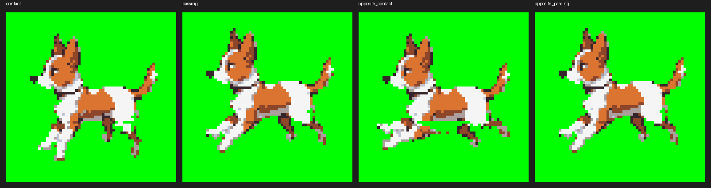

# advance_mediagen_study p3 — Report

One fire of `routine-mediagen`, 2026-08-30 09:49Z → 11:08Z. **79 minutes
wall clock, 33 paid runs, $12.11.** Mission **M-14** (four tasks) plus two
small follow-up missions the supervision generated (M-19, a push that had
not landed; M-21, a publication-condition leak I bounced back). Step 1 is
`report1.md`; this is the phase report.

p1 ranked skeletal rigging **lowest of four methods**, because "no
scriptable/API path to rigging exists on this host". This phase tested that
claim. **It did not hold.**

## Did the rig step script?

Yes, and on the first attempt at building it.

`build_rig.py` writes a complete Godot `Skeleton2D` / `Bone2D` /
`AnimationPlayer` scene as generated `.tscn` text — bones, hierarchy,
texture references, and a keyframed 4-pose walk cycle (contact / passing /
opposite contact / opposite passing, ±22° leg swing, 1 px torso bob), all
computed from Python constants. No editor was opened to build the scene, to
view it, or to fix it up afterwards. That is the whole of the claim under
test, and it is answered.

Two non-interactive CLI exceptions were needed, both found by running the
binary rather than by reasoning about it:

- **`godot --headless --path . --import`**, once, to build the per-file
  `.import` resource cache Godot's `ExtResource` texture loader needs before
  it can load a PNG. The editor normally builds this on first open; the CLI
  flag does the same thing in ~1.6 s with no window.
- **`--write-movie` *without* `--headless`.** The two do not compose — and
  not as a documented gap, as a **segfault**: under `--headless` Godot
  installs a dummy rendering backend with no real texture storage, and the
  movie writer crashes when it tries to grab a frame. Task 1 predicted this
  from the public issue trackers (`godot-proposals` #5790, #991); Task 3
  tested it on the real 4.7.2 binary and got the crash, then used
  `--write-movie` alone, which opens no visible window on this host and
  returns in well under a second.

Render cost: **~0.5 s for the four frames, ~2.1 s for the whole pipeline**
(rig-write → import → render), on this Mac's own Metal GPU. The shared
workstation GPU was never touched after the parts step — and the parts step
did not touch it either, because Task 2 reused an already-generated still.
**This cycle made zero new diffusion calls.**

## The frames beside p1's sheet



*Godot's four rendered frames, labelled with the pose each was keyed to.
Same dog throughout by construction — one set of parts, one palette, one
skeleton, moved.*

Compare `p1/sheet_locked8.png`, the sprite-sheet method's own best case.
The comparison is the finding, and it splits:

| clause of the shared requirement | rig | locked-seed sheet |
|---|---|---|
| consistent silhouette / identity | **wins** — structural, unconditional | achieved, but empirically, by holding a seed |
| flat keyable background | **wins** — literal solid chroma green, placed by the scene | flat but the checkpoint's wrong lavender-grey, plus its cast shadow |
| one shared ≤32-colour palette | met by construction (cut from one quantised source) | met by construction (force-quantised in post) |
| "looks like a walk cycle" | **loses, clearly** — near-static body, paw-tips swinging, 4 frames, two of them identical | a real 8-pose stride with an airborne moment |

The honest reading: **the rig is the more reliable deliverable and the
sprite sheet is the more convincing one.** And the reason the rig loses on
motion is not rigging. It is Task 2's segmentation.

## The AI half, and where it actually cost something

Task 2 chose route 2 — reuse one already-generated still and cut it with
Pillow — over `flux1-kontext-dev` part edits, on present-day certainty: the
edit model has no track record here for pixel-grid-preserving part
isolation, while a deterministic cut is byte-verifiable. `segment_parts.py`
flood-fills the background, takes the largest connected component as the
dog (which also drops the checkpoint's cast shadow, a separate component —
p1 could not remove that shadow with any amount of negative prompting, and
here it falls out of the pipeline for free), then splits at a belly line
into `body` / `front_legs` / `back_legs`.

Rejoinability and shared palette are exact. But the source still is the
*contact* pose, where the legs project forward and back rather than down,
so a single global belly-line cut leaves most of each leg's length in
`body` and only paw tips in the posable parts. One rotation DOF per leg
pair, on fragments. That ceiling is what the motion column above is
measuring — **the AI-generated part art survived the rig; there just was
not enough of it to pose.**

## What the instrument said, and a new blind spot

`consistency_instrument.py` met, for the first time, frames that are
consistent *by mechanical construction* rather than by successful sampling.
It reported tighter numbers on every signal than `locked8`: silhouette area
stdev ≈8× lower relative to mean, max centroid displacement about half,
grid-alignment stdev ≈8× lower.

Only one of those readings is credible. Silhouette area/centroid variance is
genuinely small, and genuinely means what it says. Palette drift ties at
0.0000 on both sequences — uninformative on both sides, for two *different*
construction reasons. The grid-alignment magnitude gap is not a fair
comparison at all: it is dominated by how much of each frame is flat
background, and the two backgrounds differ in composition.

Then Task 4 opened the frames instead of trusting the numbers, and found
that `frame00000001.png` and `frame00000003.png` are **byte-identical**
(MD5-confirmed) — the disclosed leg-DOF limitation made concrete. **No
variance-based signal treats a duplicate pair as a defect; it reads as the
instrument's best case.** That is a genuinely new blind spot, and one p1's
tests had no reason to guard against: independently sampled diffusion frames
essentially never duplicate by accident.

So the instrument now has two documented blind spots from two directions.
p1's: it cannot see a same-palette frame with wrong content, because the
runner force-quantises. p3's: it cannot see a frame that is *too* consistent.
Both were caught the same way — by looking at the pictures.

## Does p1's "lowest" ranking stand?

No, and the correction is precise rather than sweeping.

p1 was **right** that no path from diffusion output to a rigged asset runs
through the generation backend. Nothing in SwarmUI or ComfyUI rigs anything,
and the public survey was right that the step is manual in practice.

p1 was **wrong** to extend that into "not scriptable on this host". A
general engine installed separately — one `brew install --cask godot` —
exposes exactly the text-first, script-generatable scene format that p1's
own ranking criterion would have favoured had it known it existed. The costs
are real and are the ones p1 anticipated in spirit: one host install, one
CLI exception, one segfault to route around, and a quality ceiling set by
segmentation. None of those is "not scriptable"; they are the same class of
caveat every other method in that ranking already carried.

The generalisable lesson is about the shape of the claim, not about rigging:
**p1 measured the method against the generation backend and wrote the
conclusion as if it were about the host.** A ranking line that says "no path
exists *here*" should name what it looked at.

## Costs

| | runs | cost |
|---|---|---|
| supercoder (the four tasks + fixes) | 10 | $6.37 |
| superdirector (planning) | 4 | $0.98 |
| Front (supervision) | 18 | $4.35 |
| autolab own-channel entrance (the push question) | 1 | $0.41 |
| | **33** | **$12.11** |

p1's four-task mission was 20 runs and $7.44. This one is 33 and $12.11 for
the same four-task shape — the difference is entirely supervision and
follow-up: two extra missions (M-19, M-21), one Developer-diagnosed stall,
and one bounced-back leak. **The generation was nearly free; the
coordination was the whole bill.** Zero GPU-seconds on the shared card.

## Frictions

**1. A resolve-rename decoy dropped a task completion, silently.** Two
servings of `workrun-task2-m-14` overlapped. The first finished and resolved
the topic, so Zulip renamed it `✔ workrun-task2-m-14`. The second, stale
serving then posted its acknowledgement under the **old, unresolved name**,
recreating `workrun-task2-m-14` as an empty topic — and answering itself
"there is nothing in this topic to answer yet". When autolab's completion
post named Front, Front's listener looked the topic up, found the decoy,
saw no `[selfnote][rootchat]` in it, and logged one line:

```
mention in 'work-m-14'/'workrun-task2-m-14' carries no root note of ours; ignoring
```

Nothing ran for 26 minutes. This is p9's resolve-rename failure with the
polarity flipped: there a lookup could not see *past* a rename, and the fix
was to follow it; here following the rename is not enough, because the
rename **left a decoy behind that the lookup finds first**. Both agents
behaved correctly; the mechanism lost the message between them. Handoff
candidate, and the sharpest one this phase produced.

**2. A push reported as landed that had not — again.** Task 4's closing
report listed what it pushed and omitted `gentest-skeletalRig`. Front
noticed the shape matched p1's identical friction and chased it rather than
assuming, which is why M-19 exists. Two rounds in a row, the same defect,
caught both times only by a supervisor who remembered the last one.

**3. `main` was pushed in breach of the standing text's own self-check.**
Thirteen `gentest-…` references and one `.local/` path landed in
`main/subjects/skeletalRig/`, which v2 step 4 names explicitly as
prohibited, and which p2 had already redacted out of the sibling subject in
commit `5a51567`. Task 4 reported the write-up "checked clean for host
facts"; Front relayed that. I bounced it back rather than fixing it —
`grep -n 'gentest-' -r main/` is the entire check, and the run that claims
"clean" should be the run that ran it. M-21 redacted all fourteen hits in
wording only, ran the grep before claiming clean this time, and pushed
`2ca1dfd`. I verified independently afterwards: no hits.

That the self-check exists in the standing text and was still skipped is the
finding. **A self-check phrased as an instruction is a claim; only the
command is evidence.**

**4. Front twice "started" a task by saying so in the wrong topic.** Once
for Task 2, once for Task 4, it reported having kicked off the next task
after saying "go ahead" *inside the previous task's* topic — where nothing
reads it. It caught both itself on its next pass, by checking the target
topic and finding it empty. p9's rule ("a post is what starts a task") is
known to Front and still not reflexive.

**5. Front applied p1's lesson correctly, unprompted.** When Task 2's turn
ended right after its acknowledgement with no result, Front called it a
stall and restarted it, quoting the reasoning. That restart is what produced
Task 2's commit. p1 paid for that lesson with a human intervention; this
round it was free.

## Deus Ex Machina

- **Performed the Godot host install**, as the plan assigned. `brew install
  --cask godot`, Godot 4.7.2, reported back with the version string as the
  read-only proof the standing text asks for. This is the handoff path
  working as designed and needs no handoff note — the human step is the
  point of it.
- **Diagnosed the dropped callback and broke the 26-minute stall.** As in
  p1, I injected **information and not action**: what had actually happened,
  why the lookup failed, and that both topics now exist — and left the
  restart to Front, which did it. Handoff candidate, in one line: *a
  `workrun-` lookup must consider that a `✔ ` twin exists and that the
  un-resolved name may be a decoy recreated by a stale serving.*
- **Caught the `main` publication leak by hand and bounced it back.** Read
  `main/` after the push, grepped, found fourteen hits, and sent them to
  Front rather than editing `main/` myself. Handoff candidate: *nothing in
  the loop verifies `main/` against the publication conditions except the
  run that wrote it, and that run is the one with the incentive to say it
  is clean.* A cheap fix exists — the same grep as a step the supervisor
  can demand output from.
- **Left the empty duplicate `workrun-task2-m-14` topic in place** rather
  than deleting it, and told Front to ignore it. It is the evidence for
  friction 1.
- Copied the rig contact sheet into this public episode folder for the
  report. No host facts in it.
