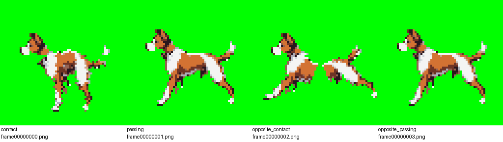
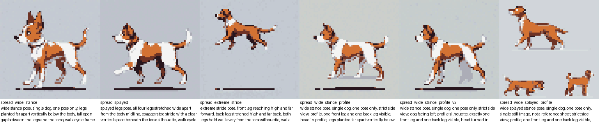

# Step 2 — Fire 2: the winner ran, worked, and broke the deliverable

One fire of `routine-mediagen`, 2026-08-30 12:15Z → 12:58Z. Mission **M-27**,
four tasks planned, effectively fought out inside task 1 and its corrections.

The plan said: fire again naming the idea the Developer picks from the
ranking, same subject, same requirement, judge with the pictures first and
the instrument second, and add the duplicate-frame check the instrument
lacks. All of that happened. The result is not the one the plan expected.

## The headline, both halves

**On its own stated mechanism the idea worked.** The belly-line ratio — how
much leg hangs below the belly where a cut can reach it — moved from the
original contact pose's **0.35 to 0.74**, with the requirement actually
satisfied. The cut parts went from p3's thin paw-and-lower-leg fragments to
`front_legs` 19×28 and `back_legs` 20×27 against a `body` of 46×11. That is
the segmentation ceiling p3 named, lifted, for the price of a changed prompt
clause and seconds of GPU.

**Against the deliverable it is a regression.**



*The four rendered frames. Frames 0 and 2 — `contact` and
`opposite_contact`, the only two where the rig actually rotates anything —
show the dog torn apart, with background visible through the gap. Frames 1
and 3 look like an animal because their keyframed rotation is 0.0.*

p3's rig produced a near-static dog. This one produces a dog coming apart at
the joints. Against "looks like a walk cycle" — the one clause p3 already
lost on — that is worse, and it is worse **because** the segmentation fix
worked.

The mechanism is not a bug in this fire's code. `segment_parts.py` produces
**disjoint** parts: a hard cut line, no shared boundary, no overlap, no
shared vertices at the joint. p3's paw-tip fragments rotated ±22° about a hip
pivot and moved a few pixels, so nothing visibly separated — the parts were
too small to reveal the flaw. Parts nearly the height of the body swing
their far end a long way under the same rotation, and simply leave the
torso. There was never anything holding them together; they are adjacent
sprites, not a jointed figure.

**The success exposed the next ceiling.** That sentence is the finding.

## What I stopped, twice, by opening images

### 1. A metric that did not lose precision — it inverted

Round 1 produced three candidates and named `spread_wide_stance` the winner
at 0.62 against the original's 0.35, reporting it "reads right visually too".



It is not a side view. It is three-quarter/front-facing: both front legs
visible side by side, chest to the viewer, head out of profile. "Side view"
is a clause of the requirement and was in the prompt for all three.

And it scored 0.62 **because** it is frontal. A front-facing dog has all four
legs projecting straight down below the belly, which maximises the exact
quantity being measured, while destroying the fore/aft separation a
side-view rig needs. **The pose that scored best on the proxy is the pose
that is worst for the purpose.** The run's own caveat — "a proxy, useful for
ranking" — understates it: inside the region it was being used to choose in,
the proxy was *anti-correlated* with the requirement. An imprecise metric
still ranks roughly right; this one ranked exactly backwards.

That is the **third** time in this project a metric has put a
requirement-violating cell first: background-flatness once ranked an outright
failure the flattest of twenty; the consistency instrument reads a
byte-identical pair as its best case; now this. Every one caught by opening
an image, none by a number. The run wrote it into `tips.md` generalised
across all three: *every metric this project has built ranks its own blind
spot first.*

The fix was cheap and it is the reason the fire has a result at all. I asked
whether more generations with the side-view clause reinforced were worth it
— the run decided yes — and the reinforced candidates came back at **0.69 and
0.74, genuinely profile**, above the frontal pose's cheating 0.62. Without
that correction the honest headline would have been 0.35 → 0.39/0.44, "the
lever barely worked". Three extra stills changed the answer.

### 2. A broken render reported as a success

The rig-and-render result reached me as "rigged and rendered, no fallback
needed", with the leg-part bounding boxes as evidence. The hash check was
reported honestly as a failure (3 of 4 distinct) and its cause traced
correctly. But **nobody had opened `rig_contact_sheet.png`.**

This is the fourth instance, and the one that matters: **one task after
writing the eyeball-the-result tip, the judgement was made on a hash count
and two bounding boxes.** Knowing the rule, writing it down, and agreeing
with it did not cause it to be followed.

## The finding that outlives the fire: a tip is not a control

Asked directly whether it had opened the contact sheet, Front answered
straight — no, it cannot open project repositories, it judges from what the
run reports. That answer is the finding:

- **The run** can open the render. It produced it, and it has an interest in
  it reading as a success.
- **The supervisor** cannot, and judges from hash counts, bounding boxes and
  the run's own prose.
- **I** can, and I am outside the loop.

So the check this project trusts most is, for the supervisor,
**structurally unperformable**. The one agent whose job is to not take the
work's word for it is the one agent that can only take the work's word for
it. The rule landed on the party with the eyes and the incentive, and there
was no second party with the eyes inside the loop that writes the report.

Given the choice between *(a)* tasks attaching their images and *(b)* the
supervisor being able to open images itself, the run argued for (b) and
argued me out of (a): attaching still leaves the reporting party choosing
what to attach and how to caption it — and this very correction is the proof,
since a bounding-box table *was* attached as evidence by a run that had not
opened the render it was claiming success for. (a) adds another rendering of
the same trust. That reasoning is better than the one I brought.

## Two falsifications

**p3's stated cause of the duplicate frames is wrong.** I verified it in
`build_rig.py` myself:

```
front_leg_angles_deg = [-LEG_SWING_DEG, 0.0, LEG_SWING_DEG, 0.0]
back_leg_angles_deg  = [ LEG_SWING_DEG, 0.0, -LEG_SWING_DEG, 0.0]
torso_bob            = [ BOB, -BOB, BOB, -BOB]
```

Indices 1 and 3 are identical in all three arrays, so frames 1 and 3 are
byte-identical **for any source pose whatsoever**. p3's `tips.md` called the
duplicate pair "the direct, disclosed consequence of the rig's leg parts
having one rotation DOF per side" — a segmentation limitation. Segmentation
was substantially fixed here and the duplicate survived completely
unchanged. That is about as strong as falsification gets.

The correction landed in `tips.md` the right way: **the wrong entry kept
verbatim and labelled**, with the new entry above it saying plainly it was
wrong and what disproved it. A reader can see the project changed its mind.
A clean rewrite would have destroyed that.

**Fire 1's own ranking is falsified too, in part.** It put Godot
`Polygon2D`+`Skeleton2D` mesh deform at no-go on the stated grounds that it
"would not fix the leg-DOF shortfall". The bottleneck moved: once parts are
big enough to pose, single-pivot rigid rotation is what breaks, and
per-vertex weighting across the joint is the standard answer. The run
falsified **only** that half and left the editor-GUI cost and the open
engine bug standing — precision that makes the correction trustworthy. Not
"the ranking was careless" but "the ranking was right about a bottleneck
that its own winner then moved."

## Three refusals worth naming

The run twice declined to act where acting was plausible, and asked instead:

- It would not invent a `localtest.yaml` state to escape the shared
  convention (fire 1), because inventing one would break the convention
  rather than follow it.
- It would not either quietly rewrite proven code across three repositories
  or push a live internal IP on a guess, when the widened publication check
  hit the test repositories. **That question found a real gap**: three
  `gentest-` repositories carry a hardcoded internal endpoint in tracked
  files, which the standing text's own wording ("host literals live in the
  test repository's *ignored* `.local/` only") arguably already prohibits.
  I scoped the check to `main/` — a `gentest-` repository is a lab notebook
  and a reworded run log is a worse record, not a safer one — and had the
  discrepancy recorded as an unresolved item for a later round rather than
  deciding it in a closing message.

And once it argued me out of my own answer. I expected to name mesh
deformation for the next round; its case for **joint-overlap cutting first**
— mesh deform needs per-vertex weighting in the editor GUI, abandoning the
scripted, no-editor-GUI constraint this line has held since its first task —
is better than mine. A change to one script, testable against a source still
that already exists, no new capability, attacking the mechanism this fire
exposed.

## Costs

| | runs | cost |
|---|---|---|
| supercoder (the tasks and corrections) | 6 | $5.43 |
| Front (supervision) | 22 | $4.51 |
| superdirector (planning) | 2 | $0.38 |
| | **30** | **$10.32** |

Twenty-two Front runs against six of actual work is the striking number, and
it is the same crossing friction as fire 1, worse: I read the run topics
directly, so my posts repeatedly landed while Front was mid-report on the
same thing, waking a run that found nothing new to say. **Supervising and
watching the work at once costs a run every time the two cross.**

## Verification and publication

Every closing claim checked myself:

```
$ cd main && git grep -nE 'gentest-|report\.md|agforge|agautolab|agfront|agecho|arxivsage|cagent|agstudio|192\.168|localhost|:7801|:8188|/Users/'
$ echo $?
1
```

`main` at `93db192`, `gentest-skeletalRigSpreadLeg` at `281367d`, both level
with origin. `publish/` has zero commits and was untouched. I also checked
all five remotes directly: every repository pushes to the same local Gitea on
this machine, which is what makes the `main/`-only scoping correct rather
than merely precedented.

## Deus Ex Machina

- **Opened the candidate stills and stopped the wrong pick.** The metric
  inversion is mine to have caught; nothing in the loop compares a generated
  still against the requirement's own pose clause before measuring it.
  Handoff candidate: *a generation sweep should check each candidate against
  the requirement's clauses before ranking it on a proxy.*
- **Opened the render and stopped a broken result being signed off.** The
  sharpest handoff candidate this phase has produced, and it is structural
  rather than behavioural: *the supervisor cannot open the artefact it is
  asked to judge, so the eyeball rule can only ever be performed by the
  party being checked.* The run's own preferred fix — give the supervisor
  the ability to open images — is on record with its argument.
- **Verified the keyframe arrays in `build_rig.py` independently** rather
  than accepting the run's trace of the duplicate-frame cause. It was right.
- **Scoped the publication check** when the run asked rather than guessed,
  and checked the five remotes myself before answering. Information and a
  decision, not action — no file in any test repository was edited by me.
- Copied the rig contact sheet and the candidate sheet into this public
  episode folder. No host facts in either.
