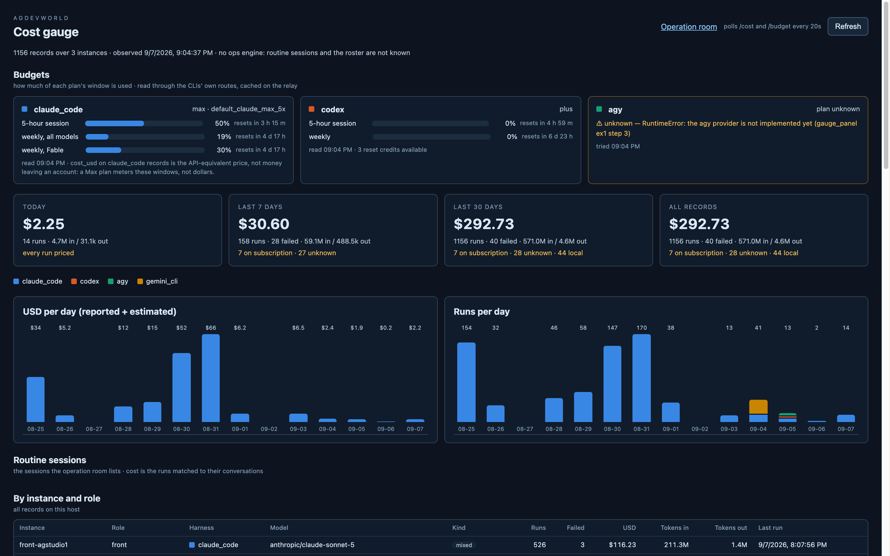

# gauge_panel ex1 step 2 — the Budgets strip on the gauge

A "Budgets" row above the tiles (`src/budgetState.ts`, `src/gaugePanel.ts`,
`src/gaugePanel.css`, agdevworld `41b51ff`): one card per harness in the
palette's fixed order, polled from `/budget` on the same 20 s tick as
`/cost` — `Promise.all` of the two, so the budget half never blanks the
cost half and vice versa.

## A card

- The harness with its slot colour, the plan and tier on the right
  (`max · default_claude_max_5x`, `plus`).
- One horizontal meter per window: single hue, filled to `percent`, the
  percent **as text** beside it, "resets in 3 h 15 m" from `resets_at`
  (`resetsIn` counts days/hours/minutes; "now" once passed; "—" when the
  vendor gave none). Claude's per-model scoped window is the third meter,
  labelled `weekly, Fable`. A non-`normal` severity is shown in amber
  beside the label; the meter is `role="meter"` with `aria-valuenow`.
- The footer: read time, then whatever the vendor added — codex's "3 reset
  credits available", Claude's `note` about the USD being notional, extra
  usage only when enabled, credits only when non-zero.
- A card that could not read is bordered and worded in amber ("⚠ unknown —
  the agy provider is not implemented yet…"), with "tried 09:04 PM", and if
  the relay kept a last good read it draws those meters greyed with "greyed:
  last good read <time>". A whole `/budget` failure is one amber line in
  the section, and the tiles below still draw.
- A percent the vendor did not give is `?`, never 0.

The screenshot is the real relay code on `:8095` with a second vite on
`:5174` pointed at it (`VITE_AGENTROOM_URL`), so the launchd relay on
`:8094` was not restarted for this step — that is one 241-call sweep saved
until step 4. The Claude session meter read 50 % here, 48 % in step 1: this
Omni session is what moves it.

## Small change on the relay

Expected failures (`RuntimeError`, `TimeoutError`) are now reported in the
provider's own words; only an unexpected exception keeps its type name in
front. The tests are unchanged and pass (125).
