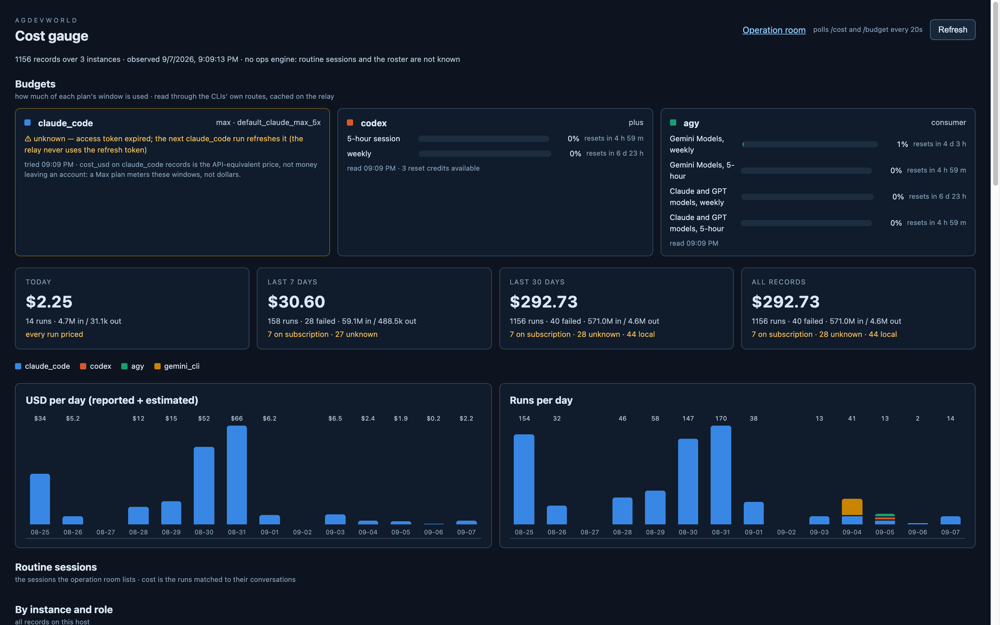

# gauge_panel ex1 step 3 — the agy provider

`AgyProvider` in `agentroom/src/agentroom/budget.py` (agdevworld
`cb406f9`): it spawns `agy -p /usage --mode plan --output-format json
--print-timeout 60s` from `AGENTROOM_AGY_BIN` (default `~/.local/bin/agy`)
and reads `command.data.groups[]`. One card, two groups, four meters, each
labelled `<group>, weekly|5-hour` and filled to `1 − remaining_fraction`
so the three harnesses read the same way. Then `/credits` for the footer:
`remaining_credits` and `upgrade_uri`, shown only when non-zero; a failed
`/credits` leaves the meters standing (`credits_error`). Fixtures are the
two payloads from the plan; 4 new tests, 129 in the suite.

## Live (2026-09-07, 21:09 JST)

| card | what it read | wall |
|---|---|---|
| agy | Gemini weekly 0.8 % used (resets in 4 d 3 h), Gemini 5h 0 %, Claude/GPT weekly 0 %, Claude/GPT 5h 0 %; credits 0 → no footer line | 9.4–10.0 s for the two calls |
| codex | plus, 0 % / 0 %, 3 reset credits | ~0.9 s |
| claude_code | **unknown — access token expired; the next claude_code run refreshes it** | file read only |

Both agy commands answer `status: SUCCESS`, `total_tokens: 0`,
`duration_seconds: 0`: no model run, no Google API call by the relay, no
token file opened. `plan` is reported as `consumer` because the CLI names
no tier.

**The unknown path proved itself unasked.** Claude Code's token is an
8-hour one: the file was renewed at 13:08 JST and `expiresAt` fell at
21:08, between step 2's screenshot (50 %) and this one. The card went amber
with the plan's wording and the USD note, never 0 — and the relay did not
touch the file (mtime still 13:08). The greyed last-good meters did not
appear only because this spare-port relay had never read a good value; the
launchd relay will have one. This Omni session runs on the same binary but
evidently holds its token in memory; the file is renewed when a CLI run
starts, which is why the message names "the next claude_code run".

## Unknown, in the CLI's words

A non-`SUCCESS` status becomes `agy answered <status>: <response>`; a
`SUCCESS` without a `command` block (the logged-out shape — the TUI's
"[Auth Needed]") becomes `agy answered without a command block (logged
out?): <response>`; a timeout `agy gave no answer within 30s`; non-JSON
output `agy exited <code> without JSON: <tail>`. Each is tested.

## The slow one

agy is ~10 s where the other two are under a second, so it has its own
30 s timeout, and `Budget.snapshot` now joins its provider threads for
`JOIN_SECONDS` (15) rather than the read timeout: a provider still reading
answers `ok: false, "still reading after 15s; the next poll will have it"`
with its last good read under `stale`, keeps its thread, and fills its own
cache — the next 20 s tick has it (tested with a gated fake). No card is
ever drawn as 0 for "slow".

## Housekeeping

A vite from yesterday still listens on IPv4 `:5174`, and my IPv6-bound
vite on the same port raced it — the first screenshot attempt read the
launchd relay and said "no route /budget". The step's screenshot is from
`:5175` with an explicit `127.0.0.1`. The launchd relay on `:8094` is
still the pre-ex1 code; step 4 restarts it.
