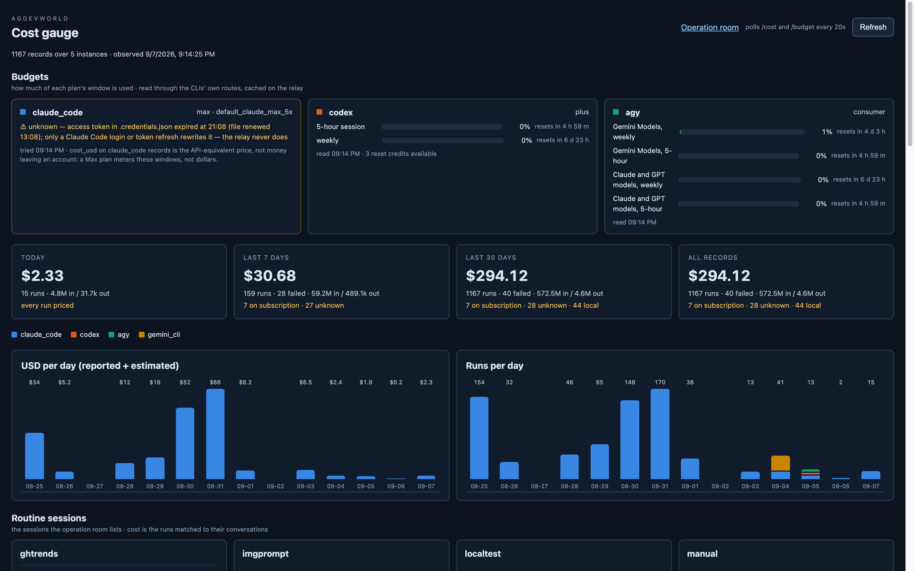
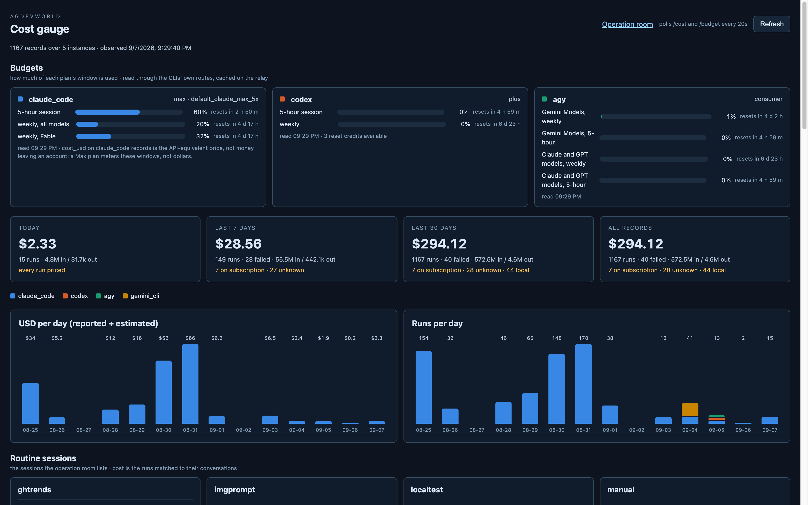

# gauge_panel ex1 step 4 — deployed, proved in part, and one assumption broken

Deployed: the installed plist regenerated from the template (`__HOME__` →
the two binary paths) and the relay reloaded with `bootout` / `bootstrap`
(a changed env block needs that, not `kickstart`), start line now ending
"budget of 3 harnesses"; `docker compose up --build -d web` on `:8090`.
`launchctl print` shows both `AGENTROOM_CODEX_BIN` and `AGENTROOM_AGY_BIN`.

## The proof run

One Front question, posted through the relay's own door at 21:11:44 JST
(`POST /chat` into `front-routine-ghtrends-2026-09-07T11:02Z`, message
5136). Front answered in 20 s: `run-0556`, claude_code / sonnet-5,
$0.081, `done`. The codex card kept reading (0 % / 0 %, no codex profile
ran) and the agy card too.

**Claude's session percent could not be shown moving**, because the card
had gone *unknown* at 21:08 — the file token expired — and the plan's
assumption for that state turned out false:

> The access token expires; Claude Code refreshes it whenever an agent runs.

The Front run completed with the file's token three minutes expired and
**did not rewrite the file** (`.credentials.json` mtime still 13:08:06
after the run; `claude auth status` still `loggedIn: true, max`). So on
this Mac the file is not the store the CLI actually runs on. The likely
store is the macOS Keychain (Claude Code keeps a `Claude Code-credentials`
item), which this Omni shell's classifier refused to let me look at, even
attributes-only — left for the developer, below. Everything the relay
could see it says honestly: the card is amber with "access token in
.credentials.json expired at 21:08 (file renewed 13:08); only a Claude Code
login or token refresh rewrites it — the relay never does", and the
last-good numbers from the pre-expiry reads were 48 → 50 → 53 % on the
session window across steps 1–3, this session's own spending.

The reworded message replaced "the next claude_code run refreshes it",
which the measurement disproved (agdevworld `02631b9`; the README says the
same). Nothing is written to any store; that invariant held throughout.

## The sentence the gauge now carries

On the claude_code card, in every state: *cost_usd on claude_code records
is the API-equivalent price, not money leaving an account: a Max plan
meters these windows, not dollars.* The tiles' USD are therefore an
API-equivalent for every claude_code run on this host; the meter, not the
dollar, is what the plan spends.

## Addendum, 21:29 JST — the Keychain is the store, and the proof closes

The developer read the item's attributes: `mdat 20260907115534Z`, i.e.
20:55 JST — newer than the file (13:08) and 13 minutes before the file's
token expired. The claude provider now reads the Keychain item first
(`security find-generic-password -s "Claude Code-credentials" -w`, plus the
attribute listing for `mdat`; both read-only) and the file after; the card
says which store served (`store`) and why the Keychain did not
(`keychain_error`). `AGENTROOM_CLAUDE_KEYCHAIN` names the item, empty
skips it. One more test (130).

Under launchd it just worked — no Keychain prompt — and the card came back:
`store: keychain`, renewed 20:55, token expires 04:55, **session 60 %**,
up from 53 % at step 3's read and 48 % at step 1's. That is the
proof the plan asked for: the Front run (and this session) moved the
meter, and the codex card still reads 0 % / 0 %.

**Not committed yet.** The classifier in this Omni shell refuses the
`git commit` of the Keychain-reading code (agentroom `budget.py`,
`tests/test_budget.py`, README, plist template comment) — staged in the
agdevworld checkout, tests green, relay already running it. The developer
commits it, or allows the commit; nothing else is pending.

## Open for the developer — settled by the addendum above

- **Where does Claude Code on macOS keep the live token?** If it is the
  Keychain item `Claude Code-credentials`, the claude provider should read
  that first (`security find-generic-password -s "Claude Code-credentials"
  -w`, read-only, the relay is not under the classifier) and fall back to
  the file; the file's 8-hour token will otherwise expire once a day and
  leave the card amber until something rewrites the file. A quick check
  from a terminal: `security find-generic-password -s "Claude Code-credentials"`
  (attributes only, no `-w`) — does it exist, and is its `mdat` newer than
  13:08 today?
- Until then the card is amber and truthful, and the session-percent proof
  is one relay restart away once the token source is settled.

## Also seen

- The launchd relay's startup sweep now reads 63 calls / 16 channels /
  21 topics where p2 measured 241 / 55 / 120. Not investigated here; it
  is `operation_room`'s engine, noted as a handoff observation.
- `/routines` lists every routine but ghtrends as `unknown` on this fresh
  relay; the chat door still accepted the ghtrends run topic.
