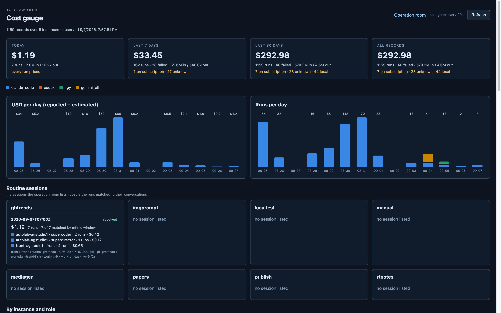

# gauge_panel step 3 — the gauge page

`/?parts=gauge` in agdevworld (`f093772`), a page for its own window: the
operation room's header links it with `target=_blank`. It draws `/cost`
and polls it every 20 s. Files: `src/costState.ts` (the read, the types,
the formatting rules), `src/gaugePanel.ts` (the page), `src/gaugePanel.css`.
Routing is one branch in `src/main.ts`; no Phaser is loaded.

## What is on it, top to bottom

- **Four tiles** — today, 7 days, 30 days, all records: USD, runs, failed,
  tokens in/out, and in amber *what the USD does not cover* ("7 on
  subscription · 27 unknown · 44 local"). A tile whose figure covers every
  run says "every run priced".
- **Two charts on one shared legend** — USD per day and runs per day, each
  stacked by harness in fixed hue order (claude_code blue, codex orange, agy
  aqua, gemini_cli yellow, agcode magenta, opencode green; palette validated
  with the dataviz validator against the page's `#101c2b` surface — all six
  checks pass). Direct totals above each bar; hover gives the per-harness
  breakdown. Two charts rather than a dual axis, because USD and runs are
  different measures — and the runs chart is where subscription runs become
  visible at all (09-04's yellow is 26 failed gemini trials, 09-05's stripes
  are the codex and agy trials).
- **Routine sessions** — one card per routine, the sessions the operation
  room lists (≤ 3), each with USD, runs, a per-agent breakdown (instance ·
  role · runs · USD), how many were matched by the mtime window rather than
  the record's own fields, and the conversations counted. Today only
  `ghtrends` has a session: p7's one-topic-per-run went live today and no
  other routine has fired since, so seven cards honestly say "no session
  listed".
- **By instance and role** — every record on this host, one row per
  instance × role × harness × model, with a kind chip.
- **Recent runs** — the last 40, failures in red, each with its
  conversation and whether it was attributed "by window".

## Rules the page keeps

- Reported and estimated USD are two numbers ("$1.19 + ~$0.55 est."),
  never one.
- A bucket with no priced run shows a dash, unless every run in it is local
  (then `$0.00` is the fact). The first render showed `$0.00` on codex and
  agy rows — the "absence is never zero" rule applied to money — fixed
  before commit.
- When the relay is down the health line says so by name and the last
  board stays on screen marked as such.

## Proof

Screenshots by `.local/opsshot.mjs` against the rebuilt `:8090` container,
three scroll positions (the page scrolls inside `main`, which is
`position: fixed` — the first attempt scrolled `window` and got three
identical shots). `tsc` clean; `vite build` clean.
