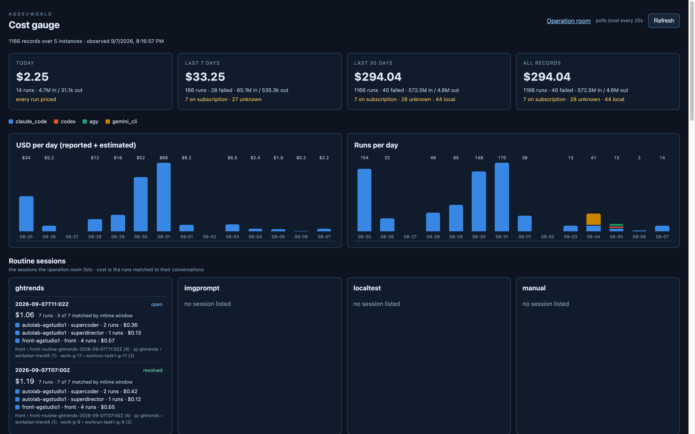

# gauge_panel step 4 — deployed, and proved on one real routine run

Deployed: relay reloaded (`launchctl kickstart -k gui/$(id -u)/com.agdev.agentroom`,
"cost over 5 roots" in its start line), `docker compose up --build -d web`
on `:8090`. The installed plist already equals the template
(`AGENTROOM_PRICES` is not needed: the tracked `agentroom/prices.json` is
the default); the stale copy under `pj-agdev/.local/launchd/` was
regenerated from the template so the diff is clean. Listeners taking the
new pyagag were restarted in step 1.

## The proof run

No routine is on a timer any more (the schedule holds one-off requests,
the last one being p7's own proof fire), so the session was started the
way the operation room does it: `POST /routines/ghtrends/start` with a
one-line instruction, at 11:02:13Z, topic
`front-routine-ghtrends-2026-09-07T11:02Z`. `rtnotes` would have been the
lighter choice and was tried first — it is retired (its standing request
carries ✔), and so are imgprompt, localtest, manual and mediagen; only
ghtrends, papers and publish can be started today.

autolab picked `llvm/llvm-project`, wrote its page and index row, committed
`62aee1d`, and Front reported "Run finished" at 11:07:56Z.

**The number matches.** The gauge's session line for 11:02Z reads
1.063035 USD over 7 runs; the seven `ag.agent-run.v1` records written on
this host since the fire sum to 1.063035 USD:

| ended (UTC) | instance | role | record | USD | conversation in record |
|---|---|---|---|---|---|
| 11:02:44 | front | front | run-0552 | 0.157 | front › …11:02Z |
| 11:03:10 | autolab | superdirector | run-0155 | 0.134 | — (window → workplan-trend5) |
| 11:03:34 | front | front | run-0553 | 0.134 | front › …11:02Z |
| 11:04:38 | autolab | supercoder | run-0220 | 0.211 | — (window → workrun-task1-g-11) |
| 11:04:56 | front | front | run-0554 | 0.127 | front › …11:02Z |
| 11:07:30 | autolab | supercoder | run-0221 | 0.144 | — (window → workrun-task1-g-11) |
| 11:07:56 | front | front | run-0555 | 0.155 | front › …11:02Z |

Every one of the seven carries `started_at`/`ended_at` (step 1, proved).
The four Front records also carry `channel`/`topic`/`generation`
(`attribution: fields`); the three autolab ones did not, and the gauge
placed them by the mtime window, correctly.

## What the run taught, and what changed because of it

- **autolab's roles run in the project clone**, so `workspace_identity`
  finds no `.local/topics` in their cwd — by design (step 1 said so). But
  the three callers all hold `context.channel`/`context.topic`, so
  agautolab `61510bd` passes them as `extra_meta` (`conversation_meta`)
  for superdirector, supercoder and director; listener restarted while
  idle. The next mission's autolab records will say `fields`. Five test
  fakes with fixed `(prompt, cwd)` arity had to learn `**kwargs`; the
  suite's one remaining failure (`test_intro`, a fake without `whoami`)
  predates this phase.
- **codex / agy / gemini never appeared** in this run: Front and autolab
  both serve on `sonnet`. The subscription and unknown kinds are proved on
  the historical records only (step 2/3).
- **A resolved run topic that keeps receiving posts splits in two.** Zulip
  lists both `front-routine-ghtrends-2026-09-07T11:02Z` and
  `✔ front-routine-ghtrends-2026-09-07T11:02Z` — and the same pair for
  07:00Z. Front resolves the topic and then posts its final report under
  the original name, which recreates it unresolved; the relay reads the
  plain-name topic and shows the session `open` although Front says "I've
  resolved this run's own topic". The gauge is unaffected (its match is by
  name and both names match the same records), but the operation room's
  session state is wrong for every run that ends this way. Not fixed here:
  it is p7's contract (`operation_room`), noted as a handoff candidate.

## Not done

- No real `estimated` cost exists yet: nothing has run on a metered key
  since the gauge went up, and `prices.json` prices only gemini-2.5-flash.
- The VM `agautolab1`'s records remain outside this host (plan: out of
  scope). `missing[]` is empty today because the roster names only the
  agstudio instances.
