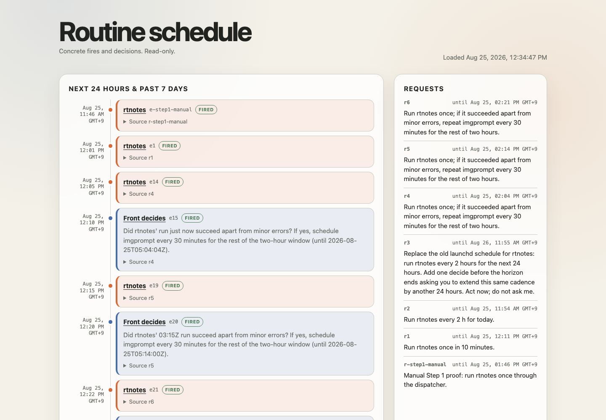

# scheduled_routine p3 — Step 4 report

Executed 2026-08-25 UTC.

## Page and service

The read-only GUI is live at `http://localhost:8093/`. The source is
`index.html` in `autodev/rtschedule`, beside the schedule it fetches with
`cache: no-store`; there is no API, form, authentication, or write path.

`com.agdev.routine-gui` serves the ignored clone with:

```text
/usr/bin/python3 -m http.server 8093 --bind 127.0.0.1
```

The launchd job is loaded and running. `HEAD /` returned 200 and
`GET /schedule.json` returned 7 requests / 23 events during verification.
The plist is pj-agdev commit `133ae63`. The page is rtschedule commits
`fc0dab7` and `58c2c73`.

The page shows all events from the past seven days through the next 24 hours,
sorted by `at`; fire/decide color, routine or question, event id, fired/pending
state, and expandable source-request text are visible. The request rail shows
every request and its `until` hard guard. CSS follows the browser's light/dark
preference and uses no external asset. Desktop 1440×1000 and mobile 390×844
captures were inspected; the mobile view stacks requests below the timeline.

Every event title is a Zulip topic link (`front-routine-<name>` for fire,
`front-schedule` for decide). The local Zulip topic prefix lives in ignored
`config.local.js`, so neither the local host nor channel id is committed. A
`zulip_topic_prefix` query parameter can override it.

## Screenshot



## What it could not show during Step 3

The page showed that a decide had fired, but not its **answer** or reasoning:
the schedule schema has only `fired_at`, not `decided_at`, outcome, or an
evidence link. Thus e15, e20, and e22 all look equally “fired” even though
their outcomes were yes, initially misjudged/corrected, and no.

It also could not show the runtime state the Developer cared about while
watching the overlap: which fire opened a Work, whether the Work was still
generating, that e17 joined e16's Work, or that e18 was deliberately a no-op.
Those facts remain in the linked Zulip run topic. This is a consequence of
the intentionally flat schedule model, not a GUI rendering omission that
Step 4 can repair without adding result data outside the plan.

Finally, the accelerated test set `fired_at` to each logical event time. The
page cannot distinguish that logical clock from the earlier real Zulip post
time; report3 is the evidence for that distinction.
