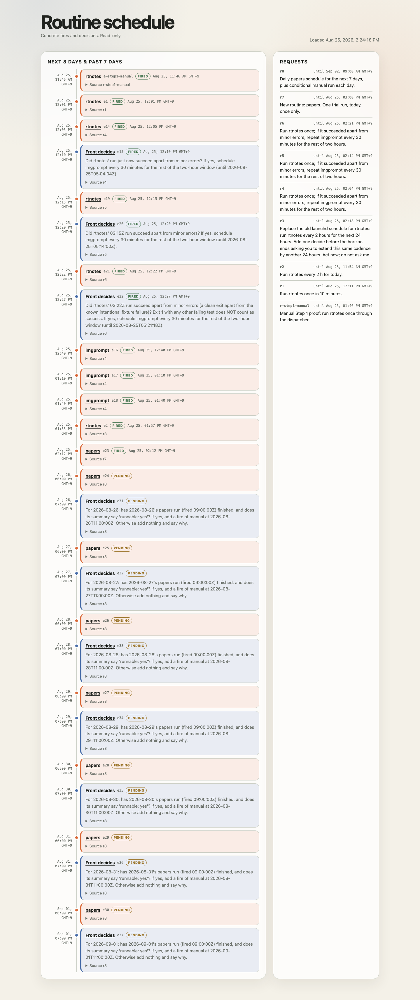

# p4 step 2 — routine B and the daily schedule

Executed 2026-08-25 UTC. Three Front runs: one to clear the old cadence, one
to write the week, and the standing text needed none.

## Standing text B — `#front › routine-manual` v1 (message 2227)

> Standing request for the `manual` routine, v1.
>
> In `#pj-papers`, ask autolab for a mission: for **every** paper in `papers/INDEX.md` with `runnable: yes` and no `manual.md` yet, write `papers/<id>/manual.md`.
>
> Each manual is a short how-to, from the paper's **official README and code only**:
>
> - prerequisites (OS, Python/CUDA versions, hardware — including how much VRAM the official docs claim),
> - install,
> - **one** minimal command that actually runs the thing,
> - expected output,
> - where the weights come from (repository, licence, gate/approval if any).
>
> It must be headed exactly:
>
> > **Unverified — written from documentation, not executed**
>
> Then set that paper's `manual` column in `papers/INDEX.md` to `yes`, and commit the manual and the index row together.
>
> **Do not run the model, download weights, or install anything** — this routine reads documentation and writes a document. If the official documentation is missing or too thin to write an honest manual, say that in `manual.md` instead of guessing, and still set the index row so the paper is not retried forever.
>
> If there is nothing to do — no `runnable: yes` row without a manual — say so and write nothing.
>
> Approve a plan that is roughly that; if it is off, say what is off. Approving means acting — start it and check it through to Done, ask nothing. Report here when it is Done: which papers got a manual, or that there was nothing to do.

The "still set the index row so the paper is not retried forever" line is
deliberate: without it a paper whose documentation is too thin is re-attempted
every single day, which is a duplicate-work trap the INDEX cannot see.

## Intervention before the week could be written

p3's rtnotes cadence (`r3`) still held nine pending fires `e3`–`e12` and a
decide `e13`, all at times **before** the first logical tick of Step 3. Under
`--now 2026-08-26T09:00:00Z` `due_events` would have found every one of them
due and fired ten rtnotes runs in a row. Advancing a clock past a live schedule
fires the whole backlog — an accelerated sitting has to clear the runway first.

Asked as the Developer (message 2252, 05:18:40Z). **One Front run, 21 s.**

> Removed `e3`–`e13` (nine `rtnotes` fires `e3`–`e12` plus decide `e13`) from
> request `r3`. Set `r3`'s `until` to `2026-08-25T05:18:50Z` (now), so nothing
> else can hang off it. Left untouched: `e23` (the `papers` trial fire), and
> everything else already fired or closed.

Verified afterwards: `r3.until` = `2026-08-25T05:18:50Z`, **pending events: 0**.
Twelve individual commits, `Remove schedule event e3` … `Set schedule request
r3 until` (`1a0d7a8`, `b1847e7` and the ten between).

Recorded as a needed feature, not a defect of Front: it did exactly what was
asked. The schedule has no way to say "suspend a request" — only remove each
event and shorten the guard.

## The daily schedule — Front's edit

Asked as the Developer (message 2255, 05:20:30Z), including the deliberate
override of Front's own 24-hour expansion guideline:

> I know this is further ahead than the 24 hours you normally expand to — that
> is deliberate here, I want the whole week visible at once, so please write
> all seven days.

**One Front run, 53 s** (05:20:30Z → 05:21:23Z). It wrote all fourteen events
and did not push back on the seven-day horizon. Its reply:

| Date | `papers` fire (09:00:00Z) | `manual` decide (10:00:00Z) |
|---|---|---|
| 2026-08-26 | `e24` | `e31` |
| 2026-08-27 | `e25` | `e32` |
| 2026-08-28 | `e26` | `e33` |
| 2026-08-29 | `e27` | `e34` |
| 2026-08-30 | `e28` | `e35` |
| 2026-08-31 | `e29` | `e36` |
| 2026-09-01 | `e30` | `e37` |

Request **`r8`**, `by: developer`, `said_at 2026-08-25T05:20:41Z`,
`until 2026-09-02T00:00:00Z`, text *"Daily papers schedule for the next 7 days,
plus conditional manual run each day."*

Fifteen commits, one per `rtschedule` call, each committed and pushed on its
own (`34402fe` request, `94dae30`–`a507160` the seven fires, `20094e7`–`e6abbe5`
the seven decides).

Each decide's ask names its own date. `e31` in full:

> For 2026-08-26: has 2026-08-26's papers run (fired 09:00:00Z) finished, and
> does its summary say 'runnable: yes'? If yes, add a fire of manual at
> 2026-08-26T11:00:00Z. Otherwise add nothing and say why.

Front volunteered the reason for the repetition: *"so no decide can be confused
about which day it's judging."* That is p3's decide-provenance lesson applied
without being told.

It also opened with **"Not needed — I already have all the event IDs from each
add command"** — declining to re-read the schedule it had just written.

## The GUI could not show the week

The check the plan asks for — *"the GUI shows 7 days × (fire, decide)"* —
**failed as written**. The timeline window was *past 7 days and next 24 hours*
(p3, built against a 24-hour rtnotes cadence). With `r8` in place, the sidebar
listed the request and **not one of its fourteen events reached the timeline**:
the last card was `papers e23`, today.

A schedule page that cannot show the plan it was asked to check is not
read-only-useful, so the future window was widened to **eight days** —
a GUI-only change, no schema change (`autodev/rtschedule` `47b9417`); the
heading now reads *Next 8 days & past 7 days*. Only then could the check be
made, and it passes: seven `papers` fires and seven `Front decides` cards, in
strict alternation, each decide carrying its own dated ask.

(Times render in the viewer's zone; 09:00Z / 10:00Z appear as 06:00 PM /
07:00 PM GMT+9.)

## Findings

1. **The GUI's horizon was tied to one routine's cadence.** 24 hours was right
   for rtnotes-every-2h and silently wrong for anything planned a week ahead —
   and the failure mode is the worst kind: the page renders perfectly, shows
   the request, and simply omits every event. Widened here; a real fix is a
   horizon the reader chooses.
2. **There is no way to suspend a request.** Clearing p3's cadence took eleven
   removals plus an `until` edit. `rtschedule` has `remove` and `set-until` and
   nothing between. Evidence for a `suspend`/`resume` on a request.
3. **Advancing the clock fires the whole backlog.** `--now` is a global clock,
   so every unfired event before the logical time is due at once. This is
   inherent to the flat-event model, is not a bug, and is a hazard worth
   writing down: an accelerated sitting must clear or expire everything it does
   not intend to fire. A `--only <request>` filter on the dispatcher would
   remove the hazard without adding decision logic.
4. **Front did not resist the seven-day horizon** once the Developer said the
   guideline was deliberately overridden, and it did not ask permission. It
   also refused to re-read state it already knew, which is the right instinct
   and worth noting because p3 saw the opposite.
